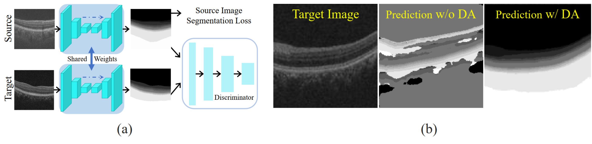
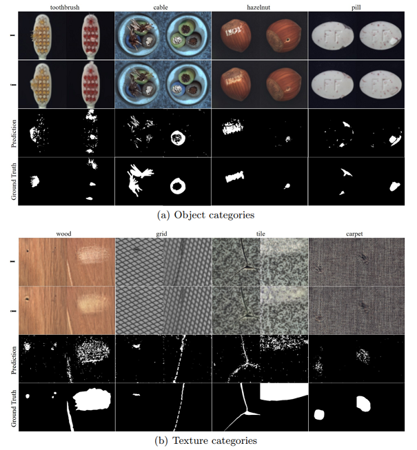

# P-Net for Anomaly Detection (Pytorch)

This is the implementation of the paper:

Kang Zhou, Yuting Xiao, Jianlong Yang, Jun Cheng, Wen Liu, Weixin Luo, Zaiwang Gu, Jiang Liu, Shenghua Gao. Encoding Structure-Texture Relation with P-Net for Anomaly Detection in Retinal Images. ECCV 2020.

using PyTorch.

**If you have any question, please feel free to contact us ({zhoukang, xiaoyt}@shanghaitech.edu.cn).**

**The implementation on MvTec dataset could be found in https://github.com/YutingXiao/P-Net_Mvtec_AD**


# Introduction


The motivation of leveraging structure information for anomaly detection. The normal medical images are highly structured, while the regular structure is broken in abnormal images. For example, the lesions (denoted by black bounding box and red arrow in (a) of diabetic retinopathy destroy the blood vessel and histology layer in retina. Thus, in the abnormal retinal fundus image and optical coherence tomography (OCT) image, the lesions (denoted by red color in (b) and (c)) broke the structure. Moreover, this phenomenon agrees with the cognition of doctors. Motivated by this clinical observation, we suggest utilizing the structure information in anomaly detection. 

# Method


The pipeline of our P-Net.

 

(a) Structure extraction network with domain adaptation (DA). (b) The qualitative results of DA for OCT images. The structure of target image cannot be extracted well without DA. 

      
                           
Qualitative results of the images in MV-Tech AD dataset.


# Dataset
The OCT dataset can be only used for the research community.

The link of Baidu drive (password: 7bl0):
https://pan.baidu.com/s/11BUG_FrYfjRCMg7T-zLeew  

The link of Google drive:
https://drive.google.com/drive/folders/1BHT-BIUm0QUyG56kfM03W9N2MrbuJB9c?usp=sharing

# Getting started

## Environment
Python 3.5.2  
Pytorch 1.1.0  
torchvision 0.2.1

<!--## Visdom-->
<!--We use visdom to visualize the result-->

## Train Structure Extraction Network
We have provide a well trained strcture extraction model for OCT layer segmentation. The pre-trained model is in the str_models folder and named "oct_str_model.pth.tar".

## Train P-Net
````
python train_P_Net.py      \
    --version OCT \
    --n_epochs 800  --save_freq 30  --lr 0.001    \
    --batch 8  --scale 224   \
    --lamd_gen 0.1  --lamd_pixel 1  --lamd_mask 0.5  \
    --gpu 1  --data_modality oct 
````


<!--# To Do-->
<!--- [x] Update the P_Net_v1.-->

<!--- [x] Update the dataloader of RESC dataset. -->

<!--- [ ] Merge the implementation on MVTec AD dataset (https://github.com/YutingXiao/P-Net_Mvtec_AD) in this branch.-->


## BibTeX 

If you use this code in your project, please cite our paper:
````
@inproceedings{zhou2020encoding,
  title={Encoding Structure-Texture Relation with P-Net for Anomaly Detection in Retinal Images},
  author={Zhou, Kang and Xiao, Yuting and Yang, Jianlong and Cheng, Jun and Liu, Wen and Luo, Weixin and Gu, Zaiwang and Liu, Jiang and Gao, Shenghua.},
  booktitle={ECCV},
  year={2020}
}
````


